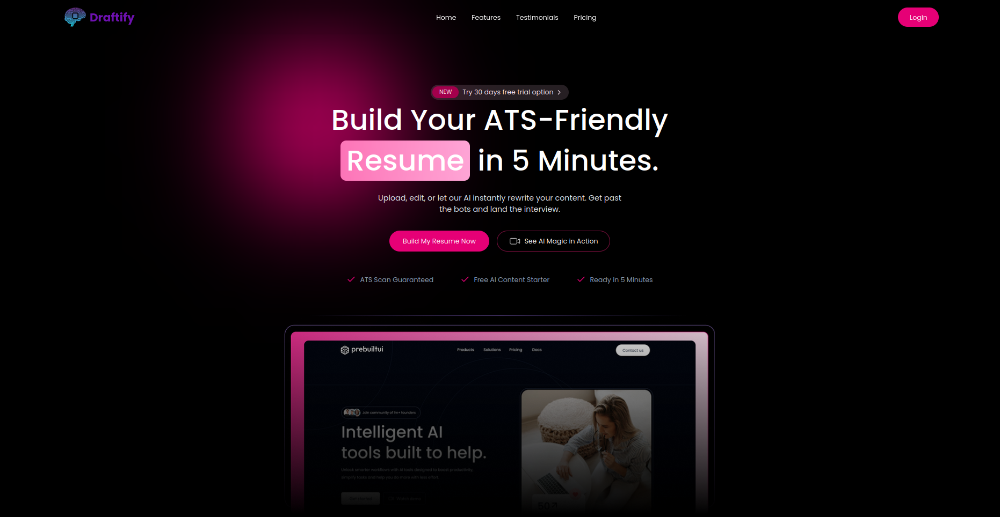
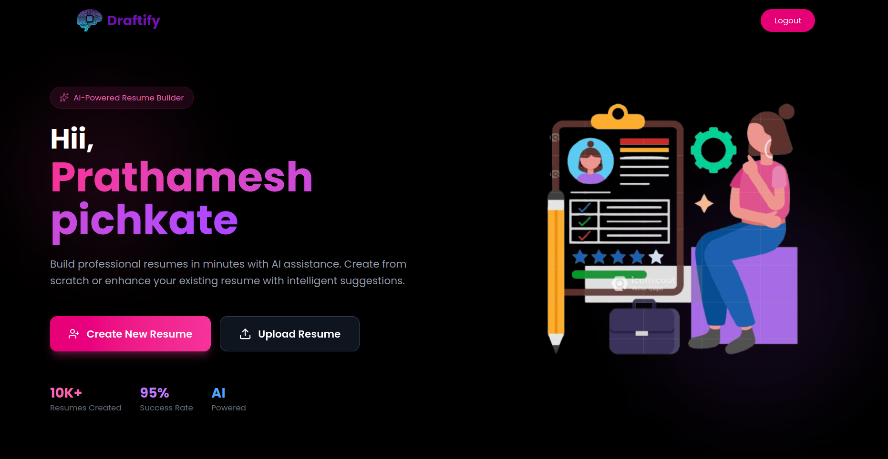
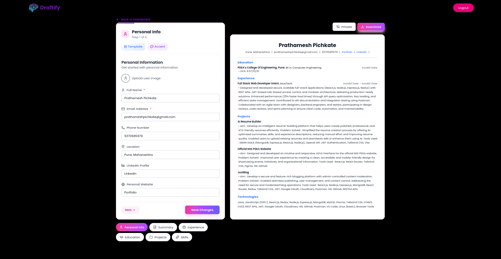

# 🚀 Online Resume Builder

A production-ready Online Resume Builder that helps users create, edit, manage, optimize and publish professional resumes with live preview links, AI-powered suggestions, background removal for profile images, and multiple modern templates.

This repository contains a React + Vite client and an Express server (Node) that together provide authentication (Firebase), resume storage (MongoDB), image handling (ImageKit), and AI resume optimization (OpenAI).

---

## Table of Contents

- [Features](#features)
- [Demo / Screenshots](#demo--screenshots)
- [Tech Stack](#tech-stack)
- [Architecture](#architecture)
- [Prerequisites](#prerequisites)
- [Quick Start](#quick-start)
  - [Server (API)](#server-api)
  - [Client (Web app)](#client-web-app)
- [Docker Setup](#docker-setup)
- [Environment Variables](#environment-variables)
- [Usage](#usage)
- [API Endpoints (overview)](#api-endpoints-overview)
- [License](#license)

---

## Features

- User sign in / sign up (Email + Google OAuth via Firebase)
- Create new resume from editable sections (personal, education, experience, projects, skills)
- Live resume preview and publishable/shareable public link
- Upload an existing resume (PDF) and optimize/clean the content using AI
- Manage resumes: add, edit, delete, duplicate
- Upload profile image and remove background automatically
- Multiple responsive resume templates
- Export to PDF, print-friendly formats
- Auto-save draft state while editing

Each feature is implemented with usability and performance in mind. The UI is responsive and aims to make resume creation fast and intuitive.

## Demo / Screenshots





## Tech Stack

- Frontend: React (18+), Vite, Tailwind CSS
- State management: Redux Toolkit
- Backend: Node.js, Express
- Database: MongoDB (Mongoose)
- Auth: Firebase Authentication (Google & Email)
- File storage & image processing: ImageKit
- AI: OpenAI (text optimization)
- Others: Multer (uploads), JWT (session tokens), Firebase Admin (server-side), react-pdftotext

## Architecture

- The repo is split into `client/` (React app) and `server/` (Express API).
- Client handles UI, authentication via Firebase, calling the server API for CRUD and AI functions.
- Server handles resume storage, image uploads/manipulation, background removal via ImageKit, and OpenAI calls for content optimization.


## Prerequisites

- Node.js v18+ and npm
- MongoDB database (Atlas or self-hosted)
- Firebase project for Auth (Web app credentials)
- ImageKit account (for image upload & background removal)
- OpenAI API key (for AI optimization)

## Quick Start

Follow these steps to run the app locally (both client and server).

### 1) Clone the repo

```bash
git clone https://github.com/prathamesh-pichkate/Resume_Builder.git
cd Resume_Builder
```

### 2) Server (API)

Open a terminal and run:

```bash
cd server
npm install
# create a .env file (see Environment Variables below)
npm run dev
```

- `npm run dev` uses `nodemon` (see `server/package.json`) to run `server.js`.
- Production: `npm start` runs `node server.js`.

### 3) Client (Web app)

Open another terminal and run:

```bash
cd client
npm install
# create .env (or .env.local) with VITE_* variables (see Environment Variables below)
npm run dev
```

- The client uses Vite. Default dev server runs on `http://localhost:5173` (or the port provided by Vite).

## Docker Setup

Run the entire application using Docker Compose for a consistent development and production environment.

### Prerequisites for Docker

- Docker installed ([download here](https://www.docker.com/products/docker-desktop))
- Docker Compose installed (usually included with Docker Desktop)

### Environment Files for Docker

Before running Docker Compose, ensure you have `.env.docker` files in both `server/` and `client/` directories:

```bash
# Server Docker environment
server/.env.docker

# Client Docker environment
client/.env.docker
```

See [Environment Variables](#environment-variables) section below for required variables.

### Running with Docker Compose (Recommended)

```bash
# Build and start both server and client containers
docker-compose up --build

# Run in detached mode (background)
docker-compose up -d --build

# View logs
docker-compose logs -f

# Stop containers
docker-compose down
```

**Access the application:**

- **Frontend**: `http://localhost:5173`
- **Backend API**: `http://localhost:3000`

### Docker Setup Details

- **Server** (`server/Dockerfile`): Node.js 18, runs `npm start` on port 3000
- **Client** (`client/Dockerfile`): Node.js 20-alpine, runs `npm run dev` on port 5173
- **MongoDB**: Uses MongoDB Atlas (no local database container)
- **Network**: Both containers communicate via a shared bridge network

### Build Individual Docker Images

#### Server Image

```bash
cd server
docker build -t resume-builder-server:latest .
docker run -p 3000:3000 --env-file .env.docker resume-builder-server:latest
```

#### Client Image

```bash
cd client
docker build -t resume-builder-client:latest .
docker run -p 5173:5173 --env-file .env.docker resume-builder-client:latest
```

### Important Notes for Docker

- Ensure `server/.env.docker` contains a valid `MONGODB_URI` pointing to MongoDB Atlas
- The `NODE_ENV` is set to `production` in the docker-compose file
- Volume mounts allow for live code reloading during development
- Use `docker-compose down -v` to remove containers and volumes if needed

For a comprehensive Docker setup guide with troubleshooting, see [`DOCKER_SETUP.md`](./DOCKER_SETUP.md).

## Environment Variables

Create `.env` files for server and client as described below.

### Server `.env` (example)

Create `server/.env` with at least:

```
PORT=3000
CLIENT_URL=http://localhost:5173
MONGODB_URI=
JWT_SECRET=

# ImageKit configuration (get from your ImageKit dashboard)
IMAGEKIT_PUBLIC_KEY=
IMAGEKIT_PRIVATE_KEY=
IMAGEKIT_URL_ENDPOINT=

# Gemini AI Configuration
GEMINI_API_KEY=
GEMINI_BASE_URL=
GEMINI_MODEL_NAME=

```

Note: The server uses `dotenv` to load these values. Keep secrets out of source control.

### Client `.env` (example)

Create `client/.env` or `client/.env.local` with:

```
# Firebase web config (used in client/src/firebase.js)
VITE_API_KEY=your_firebase_api_key
VITE_AUTH_DOMAIN=your_project.firebaseapp.com
VITE_PROJECT_ID=your_project_id
VITE_STORAGE_BUCKET=your_project.appspot.com
VITE_MESSAGING_SENDERID=messaging_sender_id
VITE_APP_ID=1:xxx:web:yyy
VITE_MEASUREMENT_ID=G-XXXXXXX

# API base URL to the server (adjust for prod)
VITE_API_BASE_URL=http://localhost:5000/api

```

Ensure `client/src/firebase.js` uses the `VITE_` prefixed variables (already configured in this repo).

## Usage

1. Register or sign in using Email or Google (Firebase Auth).
2. Create a new resume and fill sections (personal info, education, experience, projects, skills).
3. Use the live preview pane to see the resume in the selected template.
4. Upload a profile image and optionally remove the background.
5. Upload an existing PDF resume to let the AI parse and suggest improvements.
6. Publish a resume to get a shareable public link.

### Important UX notes

- Edits are auto-saved locally and sent to the server to persist the resume.
- Templates are selectable in the UI; each template maps form fields to a layout component.

## Firebase & ImageKit Notes

- Client: uses Firebase web SDK for authentication. Ensure `client/.env` contains your Firebase config values.
- Server: `firebase-admin` is included in `server/package.json`; this can be used for server-side verification of Firebase tokens and other admin tasks. Provide a service account JSON or environment-based credentials.
- ImageKit: used for image uploads and may be configured to remove background via SDK or third-party API. Provide ImageKit credentials in server `.env`.

## License

This project is provided under the MIT License — see the `LICENSE` file (add it to the repo if missing).
